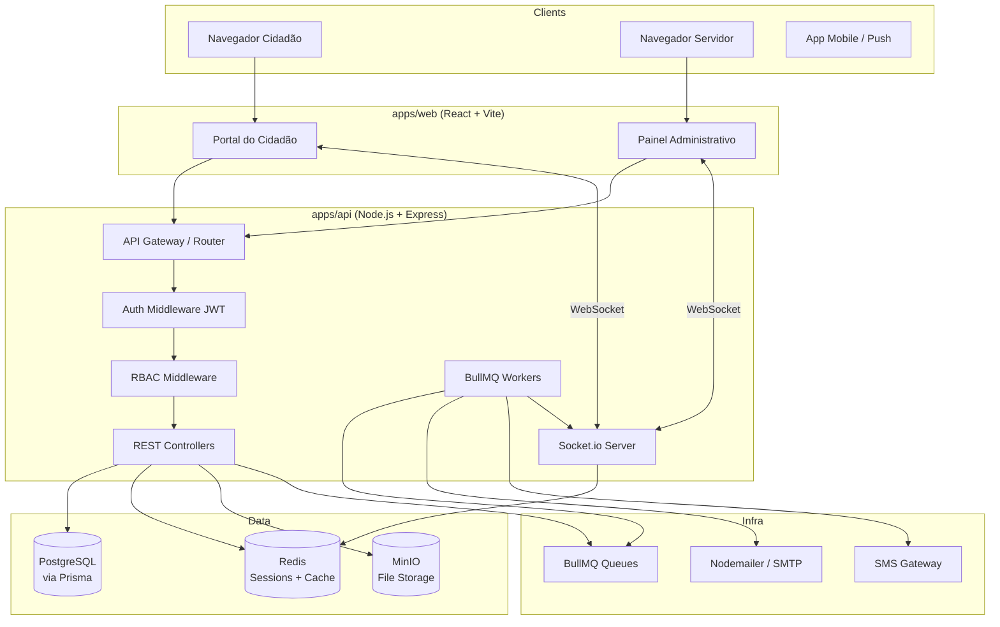
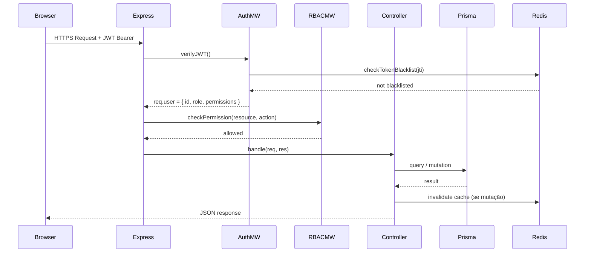
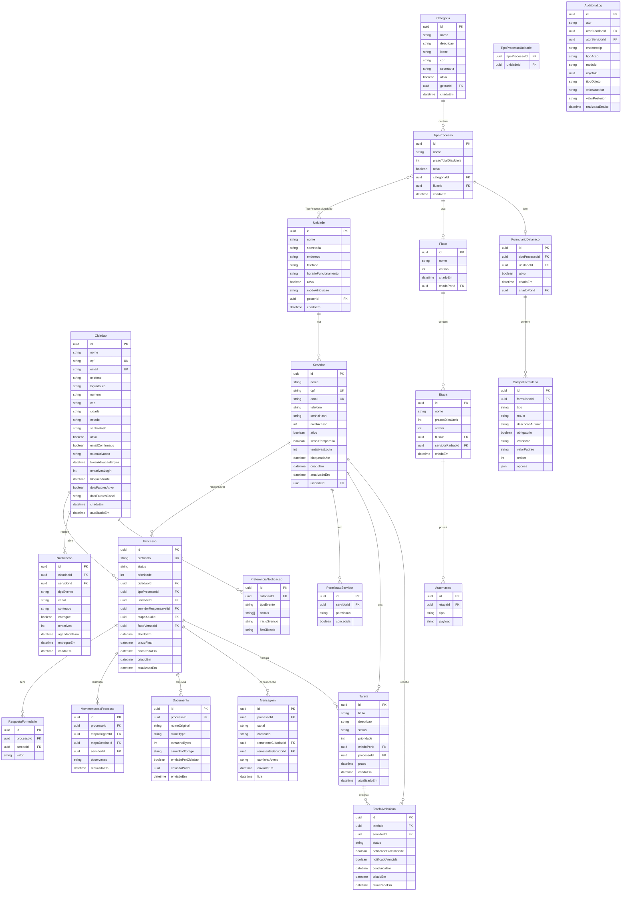
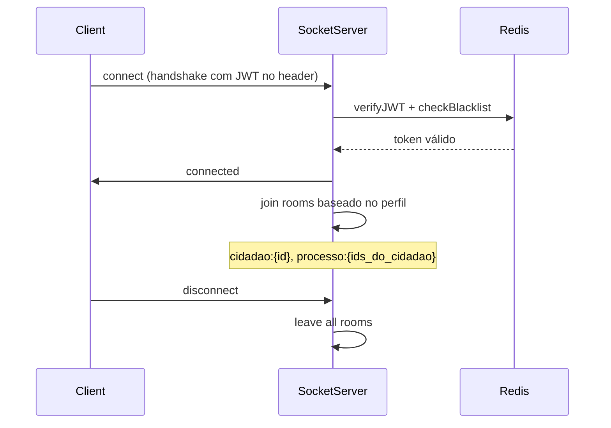
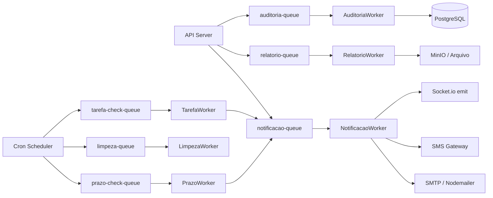
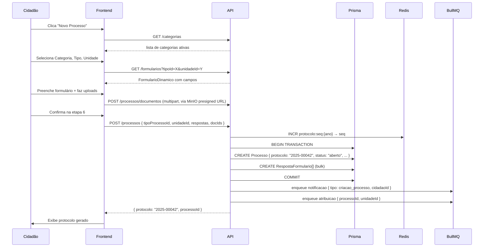
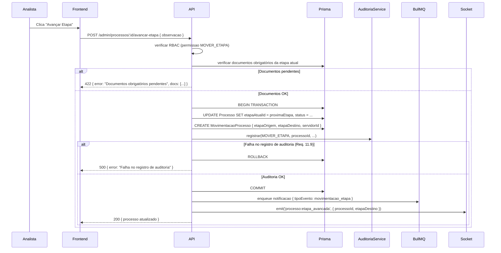
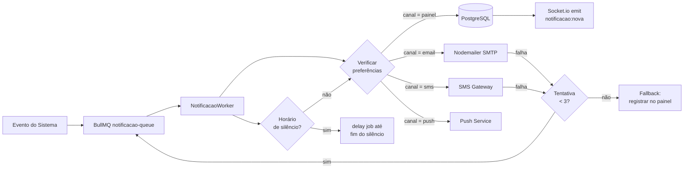
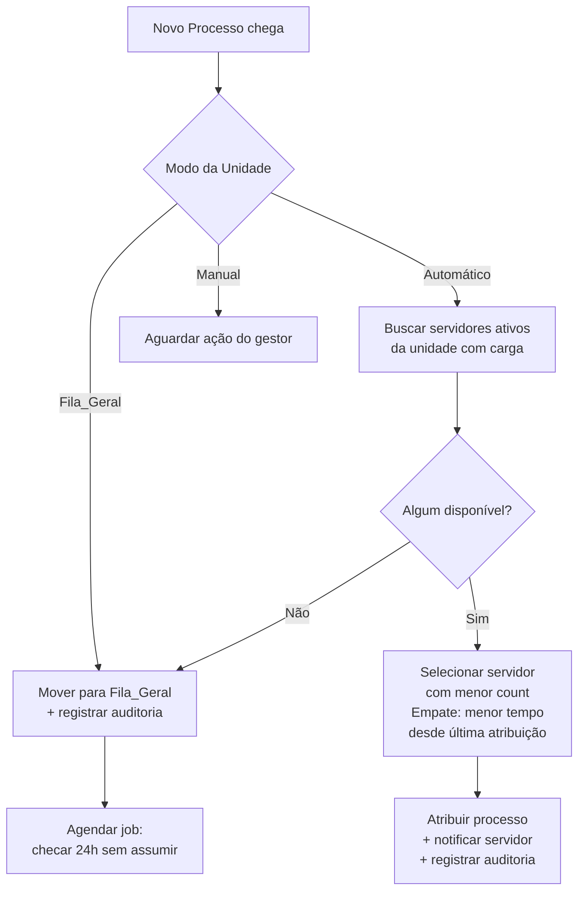

# Design Document — Auditar: Sistema de Gestão de Processos Administrativos Municipais

## Overview

O **Auditar** é uma plataforma web full-stack para gestão de processos administrativos municipais, composta por dois módulos:

- **Portal do Cidadão** — interface pública acessível por qualquer navegador, onde o cidadão se cadastra, abre processos, acompanha tramitações e se comunica com os servidores.
- **Painel Administrativo** — interface restrita a servidores municipais, onde os processos são analisados, tramitados, atribuídos e gerenciados, com dashboards, relatórios e configurações.

O sistema é organizado como um **monorepo** com três pacotes principais:

| Pacote | Responsabilidade |
|--------|-----------------|
| `apps/web` | Frontend React (Portal + Painel) |
| `apps/api` | Backend Node.js/Express |
| `packages/shared` | Tipos TypeScript, schemas Zod e utilitários compartilhados |

---

## Architecture

### Visão Geral



### Decisões Arquiteturais

| Decisão | Escolha | Justificativa |
|---------|---------|---------------|
| ORM | Prisma | Type-safety total, migrations gerenciadas, integração TS nativa |
| Cache / Sessões | Redis | TTL nativo, operações atômicas para rate-limiting, pub/sub para WS |
| Filas | BullMQ | Retry automático, prioridades, atraso de entrega (horário de silêncio) |
| Tempo real | Socket.io | Fallback automático, rooms por processo/usuário, integração com BullMQ |
| Arquivos | MinIO | S3-compatível, auto-hospedado, controle de acesso por bucket |
| Auth | JWT + bcrypt | Stateless para API, bcrypt cost-12 para senhas (Req. 20.2) |
| Containerização | Docker Compose | Ambiente reproduzível, parity dev/prod |

### Fluxo de Requisição Padrão



---

## Project Directory Structure

```
auditar/
├── apps/
│   ├── web/                          # Frontend React + Vite
│   │   ├── public/
│   │   ├── src/
│   │   │   ├── assets/
│   │   │   ├── components/           # Componentes reutilizáveis
│   │   │   │   ├── ui/               # Primitivos (Button, Input, Badge...)
│   │   │   │   ├── forms/            # FormularioDinamico renderer
│   │   │   │   ├── layout/           # AppShell, Sidebar, Header
│   │   │   │   └── shared/           # DataTable, StatusBadge, FileUpload...
│   │   │   ├── features/             # Domínios de negócio
│   │   │   │   ├── auth/             # Login, Register, 2FA
│   │   │   │   ├── cidadao/          # Painel, Processo, Perfil
│   │   │   │   ├── processos/        # Criação wizard, detalhe, histórico
│   │   │   │   ├── admin/            # Configurações, servidores, fluxos
│   │   │   │   ├── dashboard/        # Dashboards por perfil
│   │   │   │   ├── relatorios/       # Relatórios e métricas
│   │   │   │   └── auditoria/        # Log de auditoria
│   │   │   ├── hooks/                # Custom hooks (useAuth, useSocket...)
│   │   │   ├── lib/                  # axios instance, socket client, queryClient
│   │   │   ├── router/               # React Router config + guards
│   │   │   ├── store/                # Zustand stores
│   │   │   ├── portal/               # Entry point Portal do Cidadão
│   │   │   └── painel/               # Entry point Painel Administrativo
│   │   ├── index.html
│   │   ├── vite.config.ts
│   │   └── tailwind.config.ts
│   │
│   └── api/                          # Backend Node.js + Express
│       ├── src/
│       │   ├── config/               # env, database, redis, minio, bullmq
│       │   ├── middleware/           # auth, rbac, rateLimiter, csrf, sanitize
│       │   ├── modules/              # Domínios
│       │   │   ├── auth/
│       │   │   │   ├── auth.router.ts
│       │   │   │   ├── auth.controller.ts
│       │   │   │   ├── auth.service.ts
│       │   │   │   └── auth.schema.ts
│       │   │   ├── cidadaos/
│       │   │   ├── servidores/
│       │   │   ├── processos/
│       │   │   ├── categorias/
│       │   │   ├── unidades/
│       │   │   ├── fluxos/
│       │   │   ├── formularios/
│       │   │   ├── mensagens/
│       │   │   ├── notificacoes/
│       │   │   ├── auditoria/
│       │   │   └── relatorios/
│       │   ├── jobs/                 # BullMQ workers e processadores
│       │   │   ├── notificacao.worker.ts
│       │   │   ├── relatorio.worker.ts
│       │   │   ├── prazo.worker.ts
│       │   │   └── limpeza.worker.ts
│       │   ├── socket/               # Socket.io handlers
│       │   │   ├── socket.server.ts
│       │   │   └── handlers/
│       │   ├── lib/                  # prisma client, redis client, minio client
│       │   ├── utils/                # cpf validator, protocolo generator, etc.
│       │   └── app.ts
│       ├── prisma/
│       │   ├── schema.prisma
│       │   └── migrations/
│       └── tsconfig.json
│
└── packages/
    └── shared/                       # Tipos e schemas compartilhados
        ├── src/
        │   ├── types/                # Interfaces TypeScript
        │   ├── schemas/              # Schemas Zod (validação isomórfica)
        │   ├── constants/            # Enums, constantes de negócio
        │   └── utils/                # cpfValidator, protocoloFormat, etc.
        └── tsconfig.json
```

---

## Components and Interfaces

### Frontend Component Architecture

#### Layout Shell

```
AppShell
├── Header (64px fixo)
│   ├── Logo + nome do sistema
│   ├── BreadcrumbNav
│   ├── NotificationBell (contador + dropdown)
│   └── UserMenu (avatar, nome, logout)
├── Sidebar (280px colapsável)
│   ├── NavMenu (links por perfil RBAC)
│   └── CollapseButton
└── MainContent (flex-1, overflow-y-auto)
```

#### Portal do Cidadão — Páginas

| Rota | Componente | Descrição |
|------|-----------|-----------|
| `/` | `LandingPage` | Home pública |
| `/cadastro` | `RegisterPage` | Formulário de cadastro |
| `/ativar/:token` | `ActivatePage` | Ativação de conta |
| `/login` | `LoginPage` | Autenticação cidadão |
| `/painel` | `CidadaoPainelPage` | Dashboard pessoal |
| `/processos/novo` | `NovoProcessoWizard` | Wizard 6 etapas |
| `/processos/:id` | `ProcessoDetailPage` | Detalhe + abas |
| `/perfil` | `PerfilPage` | Dados pessoais |
| `/configuracoes` | `ConfiguracoesPage` | Notificações, 2FA, exclusão |

#### Painel Administrativo — Páginas

| Rota | Componente | Acesso mínimo |
|------|-----------|---------------|
| `/admin/login` | `AdminLoginPage` | Público |
| `/admin/dashboard` | `DashboardPage` | Visualizador (7) |
| `/admin/processos` | `ProcessoListPage` | Visualizador (7) |
| `/admin/processos/:id` | `ProcessoDetailAdminPage` | Analista (5) |
| `/admin/relatorios` | `RelatoriosPage` | Gestor Geral (2) |
| `/admin/auditoria` | `AuditoriaPage` | Administrador (1) |
| `/admin/configuracoes/categorias` | `CategoriasPage` | Administrador (1) |
| `/admin/configuracoes/unidades` | `UnidadesPage` | Administrador (1) |
| `/admin/configuracoes/fluxos/:id` | `FluxoEditorPage` | Admin/Gestor Cat. (1-3) |
| `/admin/configuracoes/formularios` | `FormulariosPage` | Administrador (1) |
| `/admin/servidores` | `ServidoresPage` | Administrador (1) / `gerenciar_usuarios` |
| `/admin/processos/novo` | `NovoProcessoAdminPage` | `editar` (5+) |
| `/admin/tarefas` | `TarefasPage` | Visualizador (7) — leitura das próprias; criação exige `gerenciar_tarefas` |

#### Componentes Compartilhados Críticos

**`NovoProcessoWizard`** — Wizard de 6 etapas com estado gerenciado por Zustand:
```
WizardShell
├── StepIndicator (6 steps, progresso visual)
├── Step1_Categoria     → seleção de Categoria
├── Step2_Tipo          → seleção de Tipo_de_Processo
├── Step3_Unidade       → seleção de Unidade
├── Step4_Formulario    → renderização do FormularioDinamico
├── Step5_Documentos    → upload de arquivos (react-dropzone)
└── Step6_Revisao       → revisão + confirmação + exibição do Protocolo
```

**`FluxoEditor`** — Editor visual drag-and-drop:
```
FluxoEditor (react-dnd)
├── StageList (DnD sortable)
│   └── StageCard × N (draggable)
│       ├── StageName, Prazo, Responsável
│       └── AutomationList
├── AddStageButton
├── TotalPrazoDisplay (soma automática)
└── SaveButton
```

**`FormularioDinamicoRenderer`** — Renderização dinâmica de formulários:
```typescript
// packages/shared/src/types/formulario.ts
type TipoCampo =
  | 'texto_curto'    // max 255
  | 'texto_longo'    // max 4000
  | 'numero'
  | 'data'
  | 'selecao_unica'
  | 'selecao_multipla'
  | 'upload'
  | 'cpf';

interface CampoFormulario {
  id: string;
  tipo: TipoCampo;
  rotulo: string;           // max 100 chars
  descricaoAuxiliar?: string; // max 300 chars
  obrigatorio: boolean;
  validacao?: string;       // regex expression
  valorPadrao?: unknown;
  ordem: number;
  opcoes?: string[];        // para selecao_unica / selecao_multipla
}
```

**`StatusBadge`** — Mapeamento de cores por status:
```typescript
const STATUS_COLORS: Record<StatusProcesso, string> = {
  aprovado:           'bg-green-100 text-green-800',   // #27AE60
  finalizado:         'bg-green-100 text-green-800',
  em_andamento:       'bg-yellow-100 text-yellow-800', // #F39C12
  aguardando_docs:    'bg-blue-100 text-blue-800',     // #0066CC
  vencido:            'bg-red-100 text-red-800',       // #E74C3C
  rejeitado:          'bg-red-100 text-red-800',
  aguardando_cidadao: 'bg-blue-100 text-blue-800',
};
```

**`MatrizPermissoes`** — Seletor granular de permissões no cadastro/edição de Servidor (Req. 21.11-21.13):
```
MatrizPermissoes
├── SeletorNivelAcesso        → aplica conjunto default de permissões do nível (Req. 21.12)
└── ListaPermissoes (14 toggles independentes)
    └── TogglePermissao × 14   → visualizar, editar, mover_etapa, rejeitar,
                                  solicitar_documentos, observacao_publica, observacao_interna,
                                  acessar_relatorios, gerenciar_usuarios, configurar_fluxos,
                                  acessar_auditoria, atribuir, aprovar, gerenciar_tarefas
```
O componente é somente-editável por Servidores com `gerenciar_usuarios` ou nível Administrador; ao trocar o nível de acesso, pré-marca os padrões e mantém os ajustes manuais subsequentes.

**`DashboardResumoCards` + `PainelDesempenhoEquipe`** — Dashboard estendida (Req. 9.7-9.12):
```
DashboardEstendida
├── ResumoCards            → 8 cards de contagem (total, abertos, em andamento,
│                            aguardando docs, atrasados, aprovados, finalizados, rejeitados)
├── IndicadorPrazos        → vencendo em ≤3 dias úteis + vencidos (com lista/identificação)
├── FiltrosDashboard       → Unidade, Categoria, período (aplicados por RBAC)
└── PainelDesempenhoEquipe → tabela comparável/ordenável por servidor
    └── colunas: atribuídos, em andamento, concluídos, atrasados,
                 tempo médio de conclusão, tarefas pendentes
```

**`ProcessoDetailAdmin` (estendido)** — Detalhe completo com trilha, edição corretiva e upload (Req. 24, 25):
```
ProcessoDetailAdminPage
├── AbaDados             → dados + respostas do formulário
├── TrilhaAuditoria      → quem/o quê/quando + valor anterior/posterior (Req. 24.2)
├── AcoesPendentes       → próxima etapa, docs solicitados, ações necessárias (Req. 24.3)
├── EdicaoCorretivaModal → editável apenas com permissão `editar`; audita antes/depois (Req. 24.4-24.7)
├── UploadDocumentos     → dropzone MinIO para docs solicitados (Req. 25)
└── BotaoGerarPDF        → download síncrono do PDF_do_Processo (Req. 26)
```

**`NovoProcessoAdmin`** — Abertura de processo pelo servidor (Req. 23):
```
NovoProcessoAdminPage
├── BuscaCidadaoCPF   → busca por CPF; oferece cadastro se não encontrado (Req. 23.2-23.3)
├── SeletorTipo       → Categoria → Tipo_de_Processo → Unidade
├── FormularioDinamicoRenderer (reutilizado)
└── ConfirmacaoProtocolo → exibe Protocolo gerado (mesmo motor do Portal)
```

**`OrganizadorTarefas`** — Seção de tarefas no Dashboard (Req. 27):
```
TarefasPage / seção no Dashboard
├── CriarTarefaModal      → título, descrição, prazo (data+hora), prioridade,
│                           vínculo opcional a Processo, seletor de destinatários
│                           (um / vários / todos); exige `gerenciar_tarefas` (Req. 27.1-27.5, 27.12)
├── FiltrosTarefa         → por status, prazo, vínculo a processo (Req. 27.10-27.11)
└── MinhasTarefas         → agrupadas por status (pendente/em andamento/concluída),
                            com ação de mudar o status da própria atribuição (Req. 27.6-27.7)
```

### Backend Module Interfaces

Cada módulo segue o padrão **Controller → Service → Repository (Prisma)**:

```typescript
// Exemplo: processos/processo.service.ts
interface ProcessoService {
  criar(dto: CriarProcessoDto, cidadaoId: string): Promise<Processo>;
  listar(filtros: FiltroProcessoDto, servidorId?: string): Promise<PaginatedResult<Processo>>;
  buscarPorId(id: string, actorId: string): Promise<Processo>;
  avancarEtapa(id: string, servidorId: string, dto: AvancarEtapaDto): Promise<Processo>;
  atribuir(id: string, gestorId: string, dto: AtribuirDto): Promise<Processo>;
  reatribuir(id: string, gestorId: string, dto: ReatribuirDto): Promise<Processo>;
  rejeitarProcesso(id: string, servidorId: string, motivo: string): Promise<Processo>;
}
```

---

## Data Models

### Diagrama Entidade-Relacionamento



> **NOTA DE DESIGN (decisão G — pendente de confirmação):** as siglas de Prefixo_de_Protocolo (Requisito 4.8a) são armazenadas como campo opcional `prefixoProtocolo` na `Unidade` e/ou `Categoria`. A precedência proposta é: usar o prefixo da Unidade quando existir; caso contrário, o da Categoria; caso contrário, sem prefixo. Confirmar com o usuário se o prefixo deve derivar da Unidade ou da Categoria (ver seção "Geração de Protocolo").

### Definições Detalhadas dos Modelos Principais

#### `Processo` — Status Possíveis

```typescript
// packages/shared/src/constants/processo.ts
export enum StatusProcesso {
  ABERTO              = 'aberto',
  EM_ANDAMENTO        = 'em_andamento',
  AGUARDANDO_DOCS     = 'aguardando_docs',
  AGUARDANDO_CIDADAO  = 'aguardando_cidadao',
  VENCIDO             = 'vencido',
  APROVADO            = 'aprovado',
  REJEITADO           = 'rejeitado',
  FINALIZADO          = 'finalizado',
}
```

#### `Servidor` — Níveis de Acesso

```typescript
export enum NivelAcesso {
  ADMINISTRADOR      = 1,
  GESTOR_GERAL       = 2,
  GESTOR_CATEGORIA   = 3,
  GESTOR_UNIDADE     = 4,
  ANALISTA           = 5,
  INSPETOR           = 6,
  VISUALIZADOR       = 7,
}
```

#### `PermissaoServidor` — Permissões Granulares

```typescript
export enum Permissao {
  VISUALIZAR             = 'visualizar',
  EDITAR                 = 'editar',
  MOVER_ETAPA            = 'mover_etapa',
  REJEITAR               = 'rejeitar',
  SOLICITAR_DOCUMENTOS   = 'solicitar_documentos',
  OBSERVACAO_PUBLICA     = 'observacao_publica',
  OBSERVACAO_INTERNA     = 'observacao_interna',
  ACESSAR_RELATORIOS     = 'acessar_relatorios',
  GERENCIAR_USUARIOS     = 'gerenciar_usuarios',
  CONFIGURAR_FLUXOS      = 'configurar_fluxos',
  ACESSAR_AUDITORIA      = 'acessar_auditoria',
  ATRIBUIR               = 'atribuir',
  APROVAR                = 'aprovar',
  GERENCIAR_TAREFAS      = 'gerenciar_tarefas', // NOVO (decisão G)
}
```

> **NOTA DE DESIGN (decisão G — pendente de confirmação):** foi adicionada a permissão `GERENCIAR_TAREFAS` ao enum `Permissao`, elevando o total de 13 para 14 permissões granulares. **Justificativa:** o Organizador_de_Tarefas é uma capacidade transversal, não ligada à gestão de usuários; reutilizar `GERENCIAR_USUARIOS` acoplaria indevidamente a coordenação de trabalho da equipe à administração de contas e forçaria conceder acesso ao cadastro de Servidores a quem só precisa distribuir tarefas. **Impacto na matriz RBAC:** ver seção "RBAC — Matrix de Permissões por Nível" (nova linha). Confirmar com o usuário: criar nova permissão `gerenciar_tarefas` (recomendado) OU reutilizar `gerenciar_usuarios`.

#### `Tarefa` — Status Possíveis

```typescript
// packages/shared/src/constants/tarefa.ts
export enum StatusTarefa {
  PENDENTE     = 'pendente',
  EM_ANDAMENTO = 'em_andamento',
  CONCLUIDA    = 'concluida',
}
```

#### `TipoEvento` — Eventos de Notificação

O enum a seguir consolida os eventos de notificação, incluindo os três novos eventos de Tarefa (Requisito 27). Os valores de Processo espelham os eventos já listados no Requisito 6.1.

```typescript
// packages/shared/src/constants/notificacao.ts
export enum TipoEvento {
  // Processo (Req. 6.1)
  PROCESSO_CRIADO           = 'processo_criado',
  MOVIMENTACAO_ETAPA        = 'movimentacao_etapa',
  SOLICITACAO_DOCUMENTOS    = 'solicitacao_documentos',
  PROCESSO_APROVADO         = 'processo_aprovado',
  PROCESSO_REJEITADO        = 'processo_rejeitado',
  MENSAGEM_RECEBIDA         = 'mensagem_recebida',
  PRAZO_VENCIMENTO          = 'prazo_vencimento',
  PROCESSO_ATRIBUIDO        = 'processo_atribuido',
  // Tarefa (Req. 27 — NOVOS)
  TAREFA_ATRIBUIDA          = 'tarefa_atribuida',
  TAREFA_PROXIMA_VENCIMENTO = 'tarefa_proxima_vencimento',
  TAREFA_VENCIDA            = 'tarefa_vencida',
}
```

#### Geração de Protocolo

O protocolo único `[PREFIXO-]AAAA-NNNNN` é gerado atomicamente via Redis usando `INCR`, com sequência independente por ano e por Prefixo_de_Protocolo (Requisito 4.8a–4.8c). Quando não há prefixo configurado, o formato retrocompatível `AAAA-NNNNN` é preservado.

```typescript
// apps/api/src/utils/protocolo.ts
/**
 * Gera protocolo no formato [PREFIXO-]AAAA-NNNNN.
 * @param prefixo Sigla opcional (2-5 letras maiúsculas) derivada da Unidade
 *                ou Categoria do processo. Vazio → formato AAAA-NNNNN.
 */
async function gerarProtocolo(redis: Redis, prefixo?: string): Promise<string> {
  const ano = new Date().getFullYear();
  const escopo = prefixo ? `${prefixo}:${ano}` : `${ano}`;
  const chave = `protocolo:seq:${escopo}`;
  const seq = await redis.incr(chave); // atômico → garante unicidade
  // TTL de 2 anos para evitar vazamento de memória
  await redis.expire(chave, 63_072_000);
  const base = `${ano}-${String(seq).padStart(5, '0')}`;
  return prefixo ? `${prefixo}-${base}` : base;
}

/**
 * Resolve o prefixo aplicável: Unidade tem precedência sobre Categoria.
 * Retorna undefined quando nenhum prefixo está configurado.
 */
function resolverPrefixo(unidade: { prefixoProtocolo?: string | null }, categoria: { prefixoProtocolo?: string | null }): string | undefined {
  return unidade.prefixoProtocolo ?? categoria.prefixoProtocolo ?? undefined;
}
```

> **NOTA DE DESIGN (decisão F — pendente de confirmação):** o formato de Protocolo foi enriquecido para `[PREFIXO-]AAAA-NNNNN`, mantendo `AAAA-NNNNN` quando não há prefixo (retrocompatível com os Processos já criados). A sequência passa a ser independente por prefixo+ano (ex.: `OBR-2026-00001` e `SAU-2026-00001` coexistem). **Decisões a confirmar com o usuário:** (1) o prefixo deve vir da **Unidade** ou da **Categoria** (a proposta adota Unidade com fallback para Categoria); (2) tamanho e origem da sigla (livre por configuração vs. derivada automaticamente do nome). O campo `prefixoProtocolo` é opcional em `Unidade`/`Categoria` — sistemas existentes sem prefixo permanecem inalterados.

#### Schema Prisma (fragmento principal)

```prisma
// apps/api/prisma/schema.prisma

generator client {
  provider = "prisma-client-js"
}

datasource db {
  provider = "postgresql"
  url      = env("DATABASE_URL")
}

model Cidadao {
  id                    String    @id @default(uuid())
  nome                  String    @db.VarChar(150)
  cpf                   String    @unique @db.Char(11)
  email                 String    @unique @db.VarChar(254)
  telefone              String    @db.VarChar(11)
  logradouro            String    @db.VarChar(200)
  numero                String    @db.VarChar(20)
  cep                   String    @db.Char(8)
  cidade                String    @db.VarChar(100)
  estado                String    @db.Char(2)
  senhaHash             String
  ativo                 Boolean   @default(false)
  emailConfirmado       Boolean   @default(false)
  tokenAtivacao         String?
  tokenAtivacaoExpira   DateTime?
  tentativasLogin       Int       @default(0)
  bloqueadoAte          DateTime?
  doisFatoresAtivo      Boolean   @default(false)
  doisFatoresCanal      String?
  criadoEm              DateTime  @default(now())
  atualizadoEm          DateTime  @updatedAt
  processos             Processo[]
  notificacoes          Notificacao[]
  preferencias          PreferenciaNotificacao[]
  mensagens             Mensagem[]
  acessos               AcessoHistorico[]
}

model Servidor {
  id                String              @id @default(uuid())
  nome              String              @db.VarChar(150)
  cpf               String              @unique @db.Char(11)
  email             String              @unique @db.VarChar(254)
  telefone          String?             @db.VarChar(11)
  senhaHash         String
  nivelAcesso       Int
  ativo             Boolean             @default(true)
  senhaTemporaria   Boolean             @default(true)
  tentativasLogin   Int                 @default(0)
  bloqueadoAte      DateTime?
  criadoEm          DateTime            @default(now())
  atualizadoEm      DateTime            @updatedAt
  unidadeId         String
  unidade           Unidade             @relation(fields: [unidadeId], references: [id])
  permissoes        PermissaoServidor[]
  processos         Processo[]          @relation("ServidorResponsavel")
  mensagens         Mensagem[]
  movimentacoes     MovimentacaoProcesso[]
}

model Processo {
  id                    String               @id @default(uuid())
  protocolo             String               @unique @db.VarChar(10)
  status                String
  prioridade            Int                  @default(0)
  cidadaoId             String
  cidadao               Cidadao              @relation(fields: [cidadaoId], references: [id])
  tipoProcessoId        String
  tipoProcesso          TipoProcesso         @relation(fields: [tipoProcessoId], references: [id])
  unidadeId             String
  unidade               Unidade              @relation(fields: [unidadeId], references: [id])
  servidorResponsavelId String?
  servidorResponsavel   Servidor?            @relation("ServidorResponsavel", fields: [servidorResponsavelId], references: [id])
  etapaAtualId          String?
  etapaAtual            Etapa?               @relation(fields: [etapaAtualId], references: [id])
  fluxoVersaoId         String
  fluxoVersao           Fluxo                @relation(fields: [fluxoVersaoId], references: [id])
  abertoEm              DateTime             @default(now())
  prazoFinal            DateTime
  encerradoEm           DateTime?
  criadoEm              DateTime             @default(now())
  atualizadoEm          DateTime             @updatedAt
  respostas             RespostaFormulario[]
  movimentacoes         MovimentacaoProcesso[]
  documentos            Documento[]
  mensagens             Mensagem[]
  notificacoes          Notificacao[]
}

model AuditoriaLog {
  id               String   @id @default(uuid())
  ator             String   // "cidadao" | "servidor"
  atorCidadaoId    String?
  atorServidorId   String?
  enderecoIp       String
  tipoAcao         String
  modulo           String
  objetoId         String?
  tipoObjeto       String?
  valorAnterior    String?  @db.VarChar(1000)
  valorPosterior   String?  @db.VarChar(1000)
  realizadaEmUtc   DateTime @default(now())

  @@index([tipoAcao])
  @@index([atorCidadaoId])
  @@index([atorServidorId])
  @@index([objetoId])
  @@index([realizadaEmUtc])
}

model Tarefa {
  id           String             @id @default(uuid())
  titulo       String             @db.VarChar(150)
  descricao    String?            @db.VarChar(2000)
  status       String             @default("pendente") // StatusTarefa (status agregado/da própria Tarefa)
  prioridade   Int?               // 0=baixa, 1=média, 2=alta (opcional)
  criadoPorId  String
  criadoPor    Servidor           @relation("TarefaCriadoPor", fields: [criadoPorId], references: [id])
  processoId   String?
  processo     Processo?          @relation(fields: [processoId], references: [id])
  prazo        DateTime           // data + horário do prazo
  criadoEm     DateTime           @default(now())
  atualizadoEm DateTime           @updatedAt
  atribuicoes  TarefaAtribuicao[]

  @@index([criadoPorId])
  @@index([processoId])
  @@index([prazo])
}

model TarefaAtribuicao {
  id                    String    @id @default(uuid())
  tarefaId              String
  tarefa                Tarefa    @relation(fields: [tarefaId], references: [id], onDelete: Cascade)
  servidorId            String
  servidor              Servidor  @relation("TarefaAtribuicaoServidor", fields: [servidorId], references: [id])
  status                String    @default("pendente") // StatusTarefa individual por destinatário
  notificadoProximidade Boolean   @default(false)       // idempotência da notificação de proximidade
  notificadoVencida     Boolean   @default(false)       // idempotência da notificação de vencida
  concluidaEm           DateTime?
  criadoEm              DateTime  @default(now())
  atualizadoEm          DateTime  @updatedAt

  @@unique([tarefaId, servidorId]) // uma atribuição por servidor por tarefa (Req. 27.4)
  @@index([servidorId])
  @@index([status])
  @@index([tarefaId])
}
```

> **NOTA:** os campos `prefixoProtocolo String? @db.VarChar(5)` devem ser adicionados aos modelos `Unidade` e `Categoria` (decisão F). Os relacionamentos inversos `tarefasCriadas TarefaAtribuicao[]`/`Tarefa[]` e `tarefaAtribuicoes TarefaAtribuicao[]` devem ser adicionados ao modelo `Servidor` (relações nomeadas `TarefaCriadoPor` e `TarefaAtribuicaoServidor`), e `tarefas Tarefa[]` ao modelo `Processo`.

---

## REST API Design

### Convenções

- Base URL: `/api/v1`
- Autenticação: `Authorization: Bearer <JWT>` (exceto rotas públicas)
- CSRF: header `X-CSRF-Token` em todas as mutações
- Paginação: `?page=1&pageSize=20`
- Respostas de erro: `{ error: string, field?: string, code?: string }`

### Endpoints por Domínio

#### Auth — Cidadão (`/api/v1/auth/cidadao`)

| Método | Rota | Descrição | Req. |
|--------|------|-----------|------|
| POST | `/registrar` | Cadastro de cidadão | 1 |
| POST | `/ativar` | Ativar conta via token | 1.6 |
| POST | `/reenviar-ativacao` | Reenviar link (limite 3/24h) | 1.8 |
| POST | `/login` | Autenticação com CPF+senha | 2 |
| POST | `/logout` | Encerrar sessão (blacklist JWT) | 2 |
| POST | `/2fa/verificar` | Validar código 2FA | 2.5 |
| POST | `/recuperar-senha` | Solicitar reset de senha | 7 |
| POST | `/nova-senha` | Definir nova senha via token | 7 |

#### Auth — Servidor (`/api/v1/auth/servidor`)

| Método | Rota | Descrição | Req. |
|--------|------|-----------|------|
| POST | `/login` | Login com CPF+senha | 8 |
| POST | `/logout` | Encerrar sessão | 8 |
| POST | `/trocar-senha` | Troca senha temporária | 21.3 |

#### Cidadão — Conta (`/api/v1/cidadao/conta`)

| Método | Rota | Descrição | Req. |
|--------|------|-----------|------|
| GET | `/` | Dados do perfil | 7 |
| PATCH | `/` | Editar dados pessoais | 7.1 |
| POST | `/alterar-email` | Solicitar troca de email | 7.2 |
| POST | `/confirmar-email` | Confirmar novo email | 7.2 |
| POST | `/alterar-senha` | Trocar senha | 7.3 |
| GET | `/acessos` | Histórico de 10 últimos acessos | 7.5 |
| DELETE | `/` | Solicitar exclusão da conta | 7.6 |
| GET | `/notificacoes/preferencias` | Preferências de notificação | 6.3 |
| PUT | `/notificacoes/preferencias` | Salvar preferências | 6.3 |

#### Processos — Cidadão (`/api/v1/processos`)

| Método | Rota | Descrição | Req. |
|--------|------|-----------|------|
| GET | `/` | Listar processos do cidadão | 3 |
| POST | `/` | Criar novo processo | 4 |
| GET | `/:id` | Detalhe do processo | 5 |
| GET | `/:id/historico` | Histórico de movimentações | 5.3 |
| GET | `/:id/documentos` | Lista de documentos | 5.4 |
| POST | `/:id/documentos` | Upload de documento | 4.5 |
| GET | `/:id/documentos/:docId/download` | Download de arquivo | 5.4 |
| GET | `/:id/mensagens` | Mensagens do canal público | 5.5 |
| POST | `/:id/mensagens` | Enviar mensagem | 5.6 |

#### Processos — Servidor (`/api/v1/admin/processos`)

| Método | Rota | Descrição | Req. |
|--------|------|-----------|------|
| GET | `/` | Listar + filtrar + buscar | 10 |
| POST | `/` | Abrir processo em nome de cidadão (admin) | 23 |
| GET | `/:id` | Detalhe completo + trilha de auditoria + ações pendentes | 11, 24 |
| GET | `/:id/auditoria` | Trilha de auditoria do processo | 24.2 |
| PATCH | `/:id` | Edição corretiva de dados do processo | 24.4-24.7 |
| POST | `/:id/documentos` | Anexar documento ao processo (presigned URL) | 25 |
| GET | `/:id/pdf` | Gerar e baixar PDF consolidado do processo | 26 |
| POST | `/:id/avancar-etapa` | Mover para próxima etapa | 11 |
| POST | `/:id/rejeitar` | Rejeitar processo | 11 |
| POST | `/:id/solicitar-documentos` | Solicitar docs ao cidadão | 11.6 |
| POST | `/:id/observacoes` | Registrar observação | 11.4-5 |
| POST | `/:id/atribuir` | Atribuição manual | 12 |
| POST | `/:id/reatribuir` | Reatribuição com justificativa | 12.8 |
| GET | `/:id/mensagens` | Canal público | 13 |
| POST | `/:id/mensagens` | Mensagem ao cidadão | 13 |
| GET | `/:id/mensagens/internas` | Canal interno | 13.2 |
| POST | `/:id/mensagens/internas` | Mensagem interna | 13.2 |

> **Busca de cidadão para abertura admin (Req. 23.2-23.3):** `GET /api/v1/admin/cidadaos?cpf={cpf}` retorna os dados de identificação do Cidadão ou 404 (permitindo oferecer o cadastro de novo Cidadão).

> **NOTA DE DESIGN (decisão E — pendente de confirmação):** o PDF de um único processo é gerado de forma **síncrona** em `GET /:id/pdf` (streaming do binário para download direto), reutilizando a stack de PDF já empregada pelo `RelatorioWorker` (`toPdf`). **Justificativa:** um único processo tem volume limitado e previsível; a geração síncrona simplifica o fluxo de download e evita polling de job. Para exportações em massa (vários processos), recomenda-se a geração **assíncrona** via `relatorio-queue`, seguindo o padrão do Requisito 18.5. Confirmar com o usuário se o volume por processo justifica geração assíncrona.

#### Configurações (`/api/v1/admin/config`)

| Método | Rota | Descrição | Req. |
|--------|------|-----------|------|
| GET/POST | `/categorias` | Listar / Criar categoria | 14 |
| PATCH/DELETE | `/categorias/:id` | Editar / Desativar | 14 |
| GET/POST | `/tipos-processo` | Listar / Criar tipo | 14.3 |
| PATCH/DELETE | `/tipos-processo/:id` | Editar / Desativar | 14 |
| GET/POST | `/unidades` | Listar / Criar unidade | 14.5 |
| PATCH/DELETE | `/unidades/:id` | Editar / Desativar | 14 |
| GET/POST | `/fluxos` | Listar / Criar fluxo | 15 |
| GET/PUT | `/fluxos/:id` | Detalhe / Salvar fluxo | 15 |
| GET/POST | `/formularios` | Listar / Criar formulário | 16 |
| GET/PUT | `/formularios/:id` | Detalhe / Salvar formulário | 16 |

#### Servidores (`/api/v1/admin/servidores`)

| Método | Rota | Descrição | Req. |
|--------|------|-----------|------|
| GET | `/` | Listar servidores | 21 |
| POST | `/` | Cadastrar servidor | 21.1 |
| GET | `/:id` | Detalhe | 21 |
| PATCH | `/:id` | Editar dados | 21.5 |
| POST | `/:id/desativar` | Desativar conta | 21.6 |
| PUT | `/:id/permissoes` | Atualizar permissões granulares | 8.6 |

#### Dashboard (`/api/v1/admin/dashboard`)

| Método | Rota | Descrição | Req. |
|--------|------|-----------|------|
| GET | `/analista` | Métricas do analista logado | 9.1 |
| GET | `/gestor-unidade` | Métricas da unidade | 9.2 |
| GET | `/gestor-categoria` | Métricas da categoria | 9.3 |
| GET | `/gestor-geral` | Métricas gerais | 9.4 |
| GET | `/resumo` | Cards de contagem por status + indicador de prazos, com escopo por RBAC e filtros `?unidadeId=&categoriaId=&de=&ate=` | 9.7, 9.8, 9.11, 9.12 |
| GET | `/desempenho-equipe` | Painel_de_Desempenho por Servidor (atribuídos, em andamento, concluídos, atrasados, tempo médio, tarefas pendentes), comparável e ordenável | 9.9, 9.10, 9.11, 9.12 |

Query params comuns de `/resumo` e `/desempenho-equipe`: `unidadeId` (opcional), `categoriaId` (opcional), `de`/`ate` (período; padrão últimos 30 dias). O escopo é sempre restringido pelo RBAC do Servidor autenticado (Gestor_de_Unidade → apenas sua Unidade; Administrador → todas).

#### Tarefas (`/api/v1/admin/tarefas`)

| Método | Rota | Descrição | Req. |
|--------|------|-----------|------|
| GET | `/` | Listar tarefas (filtros `?status=&de=&ate=&processoId=`) | 27.10, 27.11 |
| POST | `/` | Criar tarefa e atribuir a 1/vários/todos os servidores | 27.1-27.5, 27.12 |
| GET | `/:id` | Detalhe da tarefa com suas atribuições | 27.11 |
| PATCH | `/:id` | Editar tarefa (título, descrição, prazo, prioridade, vínculo) | 27.1, 27.12 |
| DELETE | `/:id` | Remover tarefa (autor autorizado) | 27.1 |
| GET | `/minhas` | Tarefas atribuídas ao servidor autenticado, agrupadas por status | 27.6, 27.10 |
| PATCH | `/:id/atribuicoes/minha` | Alterar o status da própria atribuição (pendente/em_andamento/concluida) | 27.7 |

#### Relatórios (`/api/v1/admin/relatorios`)

| Método | Rota | Descrição | Req. |
|--------|------|-----------|------|
| GET | `/` | Gerar relatório com filtros | 18 |
| POST | `/exportar` | Solicitar exportação CSV/PDF | 18.4 |
| GET | `/exportar/:jobId` | Verificar status / download | 18.5 |

#### Auditoria (`/api/v1/admin/auditoria`)

| Método | Rota | Descrição | Req. |
|--------|------|-----------|------|
| GET | `/` | Log paginado com filtros | 17.2 |
| POST | `/exportar` | Solicitar exportação | 17.5 |
| GET | `/exportar/:jobId` | Download do arquivo | 17.5 |

### Estrutura de Resposta Paginada

```typescript
// packages/shared/src/types/pagination.ts
interface PaginatedResult<T> {
  data: T[];
  meta: {
    total: number;
    page: number;
    pageSize: number;
    totalPages: number;
  };
}
```

---

## Real-time Architecture

### Socket.io — Salas (Rooms) e Eventos

O servidor Socket.io é montado no mesmo processo Express. Cada conexão autenticada entra em salas específicas:

```
Cidadão:     room `cidadao:{cidadaoId}`
Servidor:    room `servidor:{servidorId}`
Processo:    room `processo:{processoId}`    (servidor responsável + cidadão)
Unidade:     room `unidade:{unidadeId}`      (todos os servidores da unidade)
```

#### Eventos emitidos pelo Servidor → Cliente

| Evento | Payload | Destinatário | Req. |
|--------|---------|-------------|------|
| `processo:status_atualizado` | `{ processoId, novoStatus, etapa }` | room processo | 5.9 |
| `processo:nova_mensagem` | `{ mensagemId, processoId, remetente, conteudo }` | room processo | 5.6, 13 |
| `processo:atribuido` | `{ processoId, servidorId }` | room servidor | 12.7 |
| `processo:etapa_avancada` | `{ processoId, etapaDestino }` | room processo | 11 |
| `notificacao:nova` | `{ notificacaoId, tipo, conteudo }` | room cidadao/servidor | 6 |
| `fila:novo_processo` | `{ processoId, protocolo }` | room unidade | 12.5 |
| `dashboard:atualizar` | `{}` | room servidor | 9.5 |
| `tarefa:atribuida` | `{ tarefaId, titulo, prazo }` | room servidor | 27.5 |
| `tarefa:proxima_vencimento` | `{ tarefaId, atribuicaoId, prazo }` | room servidor | 27.8 |
| `tarefa:vencida` | `{ tarefaId, atribuicaoId, prazo }` | room servidor | 27.9 |
| `tarefa:status_atualizado` | `{ tarefaId, atribuicaoId, status }` | room servidor | 27.7 |

#### Fluxo de Conexão e Autenticação Socket.io



#### Pub/Sub Redis para Multi-instância

Quando o sistema escala horizontalmente, o Socket.io usa o adaptador Redis (via `@socket.io/redis-adapter`) para propagar eventos entre instâncias:

```typescript
// apps/api/src/socket/socket.server.ts
import { createAdapter } from '@socket.io/redis-adapter';

const pubClient = redis.duplicate();
const subClient = redis.duplicate();
io.adapter(createAdapter(pubClient, subClient));
```

---

## Queue System (BullMQ)

### Filas Definidas



### Especificação por Fila

#### `notificacao-queue`

```typescript
interface NotificacaoJob {
  tipo: 'email' | 'sms' | 'painel' | 'push';
  destinatario: { cidadaoId?: string; servidorId?: string };
  tipoEvento: TipoEvento;
  conteudo: string;
  processoId?: string;
  agendadaPara?: Date;   // para horário de silêncio (Req. 6.4)
}

// Configuração da fila
const notificacaoQueue = new Queue('notificacao', {
  defaultJobOptions: {
    attempts: 3,
    backoff: { type: 'fixed', delay: 30_000 }, // 30s entre tentativas (Req. 6.5)
    removeOnComplete: 100,
    removeOnFail: 500,
  },
});
```

#### `relatorio-queue`

```typescript
interface RelatorioJob {
  formato: 'csv' | 'pdf';
  filtros: FiltroRelatorioDto;
  servidorId: string;
  jobId: string;        // UUID para tracking de status
}
// Processado em background para >10.000 registros (Req. 18.5)
```

#### `prazo-check-queue` (cron)

Executa a cada 1 hora:
1. Busca processos com prazo vencendo em ≤3 dias úteis (Req. 6.6)
2. Busca etapas com prazo já ultrapassado (Req. 11.8)
3. Busca processos na Fila_Geral há >24h (Req. 12.6)
4. Enfileira jobs na `notificacao-queue` conforme necessário

#### `tarefa-check-queue` (cron) — NOVO (Req. 27.8, 27.9)

Segue o mesmo padrão do `prazo.worker` de processos. Executa a cada 15 minutos:
1. Busca `TarefaAtribuicao` não concluídas cujo `prazo` da `Tarefa` vence em ≤24h e ainda com `notificadoProximidade = false`; enfileira notificação `TAREFA_PROXIMA_VENCIMENTO`, marca `notificadoProximidade = true`.
2. Busca `TarefaAtribuicao` não concluídas cujo `prazo` já foi atingido e ainda com `notificadoVencida = false`; enfileira notificação `TAREFA_VENCIDA`, marca `notificadoVencida = true`.
3. As flags `notificadoProximidade`/`notificadoVencida` garantem que cada notificação seja disparada **exatamente uma vez por destinatário** (idempotência), mesmo com execuções repetidas do cron. A atualização da flag e o enfileiramento ocorrem na mesma transação para evitar duplicidade sob concorrência.

```typescript
interface TarefaCheckJob {
  // sem payload — o worker varre TarefaAtribuicao pendentes
}
// Configuração de repetição (a cada 15 min)
await tarefaCheckQueue.add('varredura', {}, {
  repeat: { pattern: '*/15 * * * *' },
});
```

#### `limpeza-queue` (cron diário)

1. Invalida tokens de ativação expirados (>48h, Req. 1.7)
2. Processa solicitações de exclusão de conta (Req. 20.6 — anonimização em 30 dias)
3. Remove arquivos temporários de uploads cancelados

---

## Frontend Component Architecture

### State Management (Zustand)

```typescript
// apps/web/src/store/authStore.ts
interface AuthState {
  cidadao: Cidadao | null;
  servidor: Servidor | null;
  token: string | null;
  setAuth: (token: string, user: Cidadao | Servidor) => void;
  logout: () => void;
}

// apps/web/src/store/wizardStore.ts
interface WizardState {
  etapaAtual: number;  // 1–6
  categoriaId: string | null;
  tipoProcessoId: string | null;
  unidadeId: string | null;
  respostasFormulario: Record<string, unknown>;
  documentos: File[];
  avancar: () => void;
  voltar: () => void;
  reset: () => void;
}

// apps/web/src/store/notificacaoStore.ts
interface NotificacaoState {
  notificacoes: Notificacao[];
  naoLidas: number;
  addNotificacao: (n: Notificacao) => void;
  marcarLida: (id: string) => void;
}
```

### React Query — Chaves de Cache

```typescript
// apps/web/src/lib/queryKeys.ts
export const queryKeys = {
  processos: {
    list: (filtros: FiltroProcessoDto) => ['processos', filtros],
    detail: (id: string) => ['processos', id],
    historico: (id: string) => ['processos', id, 'historico'],
    mensagens: (id: string) => ['processos', id, 'mensagens'],
  },
  dashboard: {
    analista: () => ['dashboard', 'analista'],
    gestorUnidade: () => ['dashboard', 'gestor-unidade'],
  },
  categorias: {
    all: () => ['categorias'],
  },
  formulario: (tipoId: string, unidadeId: string) => ['formulario', tipoId, unidadeId],
};
```

### Design System — Tokens Visuais

```typescript
// apps/web/tailwind.config.ts (extensão)
const colors = {
  primary: {
    DEFAULT: '#0066CC',
    dark:    '#003D7A',
    light:   '#E8F4FD',
  },
  success: '#27AE60',
  warning: '#F39C12',
  danger:  '#E74C3C',
  neutral: '#95A5A6',
};

const layout = {
  headerHeight:  '64px',
  sidebarWidth:  '280px',
  btnMinHeight:  '44px',   // WCAG 2.1 target size (Req. 19.3)
  btnMinWidth:   '44px',
};

// Fontes
// heading: 'Poppins', sans-serif
// body:    'Inter', sans-serif
```

---

## Critical Data Flows

### Fluxo 1: Criação de Processo (Wizard 6 Etapas)



### Fluxo 2: Tramitação de Processo (Avanço de Etapa)



### Fluxo 3: Pipeline de Notificações



### Fluxo 4: Atribuição Automática



---

## Security Architecture

### JWT e Sessões

```typescript
// Estrutura do JWT payload
interface JwtPayload {
  sub: string;          // userId
  role: 'cidadao' | 'servidor';
  nivel?: number;       // para servidores: nível de acesso
  permissions?: string[]; // permissões granulares em cache
  jti: string;          // JWT ID para blacklist
  iat: number;
  exp: number;          // 1h para servidores, 7d com "manter conectado"
}
```

**Blacklist via Redis**: no logout, `SET blacklist:{jti} 1 EX {ttl_restante}`.

### RBAC — Matrix de Permissões por Nível

| Ação | Adm (1) | GG (2) | GC (3) | GU (4) | An (5) | Ins (6) | Vi (7) |
|------|:-------:|:------:|:------:|:------:|:------:|:-------:|:------:|
| Visualizar processos | ✓ | ✓ | ✓ | ✓ | ✓ | ✓ | ✓ |
| Editar processo | ✓ | — | — | ✓ | ✓ | — | — |
| Mover etapa | ✓ | — | — | ✓ | ✓ | — | — |
| Rejeitar | ✓ | — | — | ✓ | G* | — | — |
| Solicitar documentos | ✓ | — | — | ✓ | ✓ | — | — |
| Obs. pública | ✓ | — | — | ✓ | ✓ | ✓ | — |
| Obs. interna | ✓ | — | ✓ | ✓ | ✓ | ✓ | — |
| Relatórios | ✓ | ✓ | ✓ | ✓ | — | — | — |
| Gerenciar usuários | ✓ | — | — | — | — | — | — |
| Configurar fluxos | ✓ | — | ✓ | — | — | — | — |
| Auditoria | ✓ | — | — | — | — | — | — |
| Atribuir | ✓ | — | — | ✓ | — | — | — |
| Aprovar | ✓ | — | — | ✓ | G* | — | — |
| Gerenciar tarefas | ✓ | G* | G* | ✓ | — | — | — |

*G = depende de permissão granular configurada pelo Administrador (Req. 8.6)

**Regra de Edição_Corretiva (Req. 24.4-24.7):** a edição corretiva de dados de um Processo é permitida **exclusivamente** a Servidores com a permissão granular `editar` (linha "Editar processo" da matriz). Toda Edição_Corretiva é registrada no Módulo_de_Auditoria com valor anterior e posterior; se o registro de auditoria falhar, a alteração não é persistida (Req. 24.7).

**Regra do Organizador_de_Tarefas (Req. 27.1):** criar, atribuir, editar e remover Tarefas exige a permissão granular `gerenciar_tarefas` (nova) ou nível Administrador. Qualquer Servidor destinatário pode alterar o status **apenas da sua própria** `TarefaAtribuicao` (Req. 27.7), independentemente de possuir `gerenciar_tarefas`.

**Regra de abertura de Processo pelo Servidor (Req. 23.1):** abrir Processo em nome de Cidadão exige a permissão granular `editar` ou nível Administrador.

**Regra de geração de PDF_do_Processo (Req. 26.6):** gerar o PDF exige a permissão granular `visualizar` sobre o Processo.

### Middleware de Segurança (ordem de execução)

```typescript
// apps/api/src/app.ts — middleware stack
app.use(helmet());                    // headers de segurança
app.use(cors(corsConfig));            // CORS restritivo
app.use(rateLimiter);                 // 100 req/min por IP nas rotas públicas (Req. 20.5)
app.use(express.json({ limit: '1mb' }));
app.use(sanitizeMiddleware);          // rejeitar SQL injection, XSS, control chars (Req. 20.3)
app.use(csrfMiddleware);              // validar X-CSRF-Token em mutações (Req. 20.4)
app.use('/api', router);
```

### Proteção de Arquivos (MinIO)

- Upload via **presigned URL** gerada pela API (expiração 5 min)
- Download via endpoint API que valida autorização antes de gerar URL presigned de leitura
- Bucket separado por unidade: `processos/{unidadeId}/{processoId}/{filename}`
- Tamanho validado no lado da API antes de gerar presigned URL

### Hashing de Senhas

```typescript
// bcrypt cost-12 conforme Req. 20.2
const BCRYPT_ROUNDS = 12;
const hash = await bcrypt.hash(senha, BCRYPT_ROUNDS);
```

### Anonimização LGPD (Req. 20.6 e 7.6)

```typescript
// Executado pelo LimpezaWorker após 30 dias da solicitação
async function anonimizarCidadao(cidadaoId: string) {
  await prisma.cidadao.update({
    where: { id: cidadaoId },
    data: {
      nome:     `ANONIMIZADO_${cidadaoId.slice(0, 8)}`,
      cpf:      '00000000000',
      email:    `anonimizado_${cidadaoId}@deletado.local`,
      telefone: '00000000000',
    },
  });
}
```

---

## Cache Strategy (Redis)

### Estrutura de Chaves Redis

| Chave | Tipo | TTL | Uso |
|-------|------|-----|-----|
| `session:{jti}` | STRING | Exp. do JWT | Sessão ativa |
| `blacklist:{jti}` | STRING | TTL residual | JWT revogado |
| `protocolo:seq:{ano}` | STRING | 2 anos | Contador de protocolo |
| `login:attempts:{cpf}` | STRING | 15 min | Controle de bloqueio |
| `login:blocked:{cpf}` | STRING | 15 min | Flag de bloqueio |
| `ativacao:resend:{cidadaoId}` | STRING | 24h | Contador de reenvios (max 3) |
| `rate:{ip}` | STRING | 60s | Rate limiting |
| `cache:dashboard:{role}:{id}` | STRING | 5 min | Cache de dashboard (Req. 9.5) |
| `cache:categorias` | STRING | 10 min | Lista de categorias ativas |
| `cache:formulario:{tipoId}:{unidadeId}` | STRING | 10 min | FormularioDinamico |
| `2fa:code:{cidadaoId}` | STRING | 10 min | Código 2FA (Req. 2.5) |
| `relatorio:job:{jobId}` | HASH | 1h | Status de exportação |

### Estratégia de Invalidação

- **Cache de dashboard**: invalidado automaticamente pelo cron a cada 5 min e por writes relevantes (atribuição, avanço de etapa)
- **Cache de formulários/categorias**: invalidado em writes de configuração (save de formulário, edição de categoria)
- **Rate limiting**: janela deslizante de 60s via `INCR` + `EXPIRE`

---

## Correctness Properties

*A property is a characteristic or behavior that should hold true across all valid executions of a system — essentially, a formal statement about what the system should do. Properties serve as the bridge between human-readable specifications and machine-verifiable correctness guarantees.*

### Property 1: Validação de CPF

*For any* string de 11 dígitos, o validador de CPF deve aceitar exatamente aquelas que possuem dígitos verificadores corretos conforme o algoritmo oficial da Receita Federal — e rejeitar todas as demais.

**Validates: Requirements 1.2**

---

### Property 2: Unicidade de CPF no Cadastro

*For any* CPF que já esteja associado a uma conta de cidadão ativa ou inativa, uma tentativa de cadastro com esse mesmo CPF deve ser rejeitada, e o total de contas cadastradas deve permanecer inalterado.

**Validates: Requirements 1.3**

---

### Property 3: Bloqueio por Tentativas Consecutivas de Login

*For any* conta de cidadão ou servidor, após exatamente 5 tentativas consecutivas de login com credenciais incorretas, a conta deve ser bloqueada, e qualquer tentativa adicional deve ser rejeitada com indicação de bloqueio até que o período expire.

**Validates: Requirements 2.3, 20.8**

---

### Property 4: Formato e Unicidade do Protocolo (com Prefixo)

*For any* conjunto de processos criados no sistema — com ou sem Prefixo_de_Protocolo, e para qualquer prefixo de 2 a 5 letras maiúsculas — todo protocolo gerado deve obedecer ao formato `[PREFIXO-]AAAA-NNNNN` (prefixo opcional, 4 dígitos do ano, hífen, no mínimo 5 dígitos sequenciais), a sequência deve ser independente por prefixo e por ano, e nenhum par de processos distintos deve compartilhar o mesmo protocolo, mesmo sob criação simultânea.

**Validates: Requirements 4.8, 4.8a, 4.8b, 4.8c, 23.5**

---

### Property 5: Correção da Busca Rápida

*For any* conjunto de processos armazenados e qualquer termo de busca com 3 ou mais caracteres, todos os processos retornados devem conter o termo (correspondência parcial, case-insensitive) no número de protocolo, no nome do cidadão ou no CPF do cidadão — e nenhum processo que não atenda a esse critério deve aparecer nos resultados.

**Validates: Requirements 10.5**

---

### Property 6: Completude do Registro de Auditoria

*For any* ação realizada por qualquer ator no sistema (cidadão ou servidor), o registro de auditoria correspondente deve conter: data e hora em UTC com precisão de milissegundos, identificação do ator, endereço IP, tipo de ação, identificador do objeto afetado, e — quando aplicável — os valores anterior e posterior do campo alterado.

**Validates: Requirements 17.3**

---

### Property 7: Algoritmo de Atribuição Automática por Menor Carga

*For any* conjunto de servidores ativos em uma unidade com contagens distintas de processos em andamento, a atribuição automática deve selecionar o servidor com o menor número de processos ativos; em caso de empate, deve selecionar o servidor com o menor tempo decorrido desde sua última atribuição recebida.

**Validates: Requirements 12.2**

---

### Property 8: Rejeição de Entradas com Padrões de Injeção

*For any* entrada de dados proveniente de cidadão ou servidor que contenha padrões de SQL injection, scripts XSS ou caracteres de controle, o sistema deve rejeitar a requisição inteira sem persistir nenhum dado parcial, e retornar uma mensagem de erro indicando que a entrada é inválida.

**Validates: Requirements 20.3, 20.9**

---

### Property 9: Prazo Total do Fluxo é Soma das Etapas

*For any* configuração de fluxo com N etapas, o prazo total exibido deve ser igual à soma aritmética dos prazos em dias úteis de todas as N etapas configuradas, e esse valor deve ser recalculado corretamente após qualquer adição, remoção ou alteração de prazo de etapa.

**Validates: Requirements 15.5**

---

### Property 10: Consistência de Agregação do Dashboard

*For any* conjunto de processos dentro do escopo de acesso de um Servidor, a soma das contagens dos cards de status mutuamente exclusivos deve ser igual ao total de processos do escopo, e a soma dos processos atribuídos por Servidor no Painel_de_Desempenho deve ser igual ao total de processos atribuídos no escopo.

**Validates: Requirements 9.7, 9.9**

---

### Property 11: Escopo RBAC do Dashboard

*For any* conjunto de processos distribuídos entre múltiplas Unidades e qualquer Gestor_de_Unidade, todos os processos e Servidores refletidos nos indicadores, cards e Painel_de_Desempenho do Dashboard devem pertencer exclusivamente à Unidade sob responsabilidade daquele Gestor_de_Unidade, e nenhum item de outra Unidade deve ser computado.

**Validates: Requirements 9.11, 9.12**

---

### Property 12: Round-trip Exato das Permissões Granulares

*For any* subconjunto do conjunto de Permissões_Granulares atribuído a um Servidor, salvar essas permissões e em seguida recarregá-las deve produzir exatamente o mesmo subconjunto — sem permissões adicionadas ou removidas silenciosamente.

**Validates: Requirements 21.12, 21.13**

---

### Property 13: Edição Corretiva Registra Valores Anterior e Posterior

*For any* Edição_Corretiva de um campo de um Processo, o registro de auditoria correspondente deve conter o valor anterior igual ao valor do campo imediatamente antes da alteração e o valor posterior igual ao novo valor aplicado.

**Validates: Requirements 24.5**

---

### Property 14: Pendência de Documentos é a Diferença de Conjuntos

*For any* conjunto de documentos solicitados em um Processo e qualquer subconjunto de documentos anexados, a lista de documentos pendentes exibida deve ser exatamente a diferença entre os documentos solicitados e os documentos anexados; quando todos os solicitados forem anexados, a pendência deve ser vazia.

**Validates: Requirements 25.5**

---

### Property 15: Completude e Exclusão de Conteúdo do PDF do Processo

*For any* Processo, o conteúdo montado do PDF_do_Processo deve conter todas as seções obrigatórias (protocolo, tipo, unidade, status, dados do cidadão, respostas do formulário, histórico de movimentações, mensagens públicas e lista de documentos) e não deve conter nenhuma mensagem do canal interno entre Servidores.

**Validates: Requirements 26.1, 26.4**

---

### Property 16: Atribuição para Todos Gera Uma Atribuição por Servidor Ativo

*For any* conjunto de Servidores com estados ativo/inativo variados, criar uma Tarefa direcionada a todos os Servidores ativos deve gerar exatamente uma Atribuição_de_Tarefa para cada Servidor ativo e nenhuma para Servidores inativos.

**Validates: Requirements 27.4**

---

### Property 17: Isolamento de Status por Atribuição de Tarefa

*For any* Tarefa com N Atribuições_de_Tarefa, alterar o status de uma Atribuição_de_Tarefa não deve alterar o status de nenhuma das demais N−1 Atribuições_de_Tarefa da mesma Tarefa; e ao definir o status como concluída, a data e hora de conclusão daquela Atribuição_de_Tarefa deve ser registrada.

**Validates: Requirements 27.7**

---

### Property 18: Notificação de Prazo de Tarefa Exatamente Uma Vez por Destinatário

*For any* Atribuição_de_Tarefa não concluída, e independentemente do número de execuções da varredura de prazos, a Notificação de proximidade de vencimento deve ser disparada no máximo uma vez, e a Notificação de Tarefa vencida deve ser disparada exatamente uma vez enquanto a Atribuição_de_Tarefa permanecer não concluída após o prazo.

**Validates: Requirements 27.8, 27.9**

---

## Error Handling

### Códigos de Erro Padronizados

```typescript
// packages/shared/src/constants/errors.ts
export const ErrorCodes = {
  // Auth
  INVALID_CREDENTIALS:       'AUTH_001',
  ACCOUNT_LOCKED:            'AUTH_002',
  ACCOUNT_NOT_ACTIVATED:     'AUTH_003',
  TOKEN_EXPIRED:             'AUTH_004',
  INSUFFICIENT_PERMISSIONS:  'AUTH_005',

  // Validação
  VALIDATION_ERROR:          'VAL_001',
  CPF_DUPLICADO:             'VAL_002',
  CPF_INVALIDO:              'VAL_003',
  CAMPO_OBRIGATORIO:         'VAL_004',
  FORMATO_INVALIDO:          'VAL_005',

  // Processo
  PROCESSO_NAO_ENCONTRADO:   'PROC_001',
  PROCESSO_ACESSO_NEGADO:    'PROC_002',
  DOCUMENTOS_PENDENTES:      'PROC_003',
  PROCESSO_ENCERRADO:        'PROC_004',

  // Arquivo
  ARQUIVO_FORMATO_INVALIDO:  'ARQ_001',
  ARQUIVO_MUITO_GRANDE:      'ARQ_002',
  LIMITE_ARQUIVOS:           'ARQ_003',

  // Tarefa
  TAREFA_NAO_ENCONTRADA:     'TAR_001',
  TAREFA_PRAZO_INVALIDO:     'TAR_002',   // prazo no passado (Req. 27.12)
  TAREFA_SEM_DESTINATARIO:   'TAR_003',   // nenhum destinatário informado (Req. 27.2)

  // PDF do processo
  PDF_GERACAO_FALHA:         'PDF_001',   // Req. 26.5

  // Sistema
  AUDITORIA_FALHA:           'SYS_001',
  SERVICO_INDISPONIVEL:      'SYS_002',
};
```

### Estrutura de Resposta de Erro

```typescript
interface ApiError {
  error: string;          // mensagem legível
  code: string;           // ErrorCode (acima)
  field?: string;         // campo específico (para validação)
  details?: unknown;      // detalhes adicionais (dev mode)
}
```

### Tratamento de Falhas Críticas

| Cenário | Comportamento | Req. |
|---------|--------------|------|
| Falha no registro de auditoria ao avançar etapa | Rollback da transação + erro 500 | 11.9 |
| Falha no envio de email/SMS após 3 tentativas | Fallback para notificação no painel | 6.5 |
| Indisponibilidade do indicador do dashboard | Exibir erro no widget, preservar demais | 9.6 |
| Falha na exportação de relatório/auditoria | Preservar filtros + permitir nova tentativa | 17.7, 18.4 |
| Falha na submissão do processo | Preservar dados preenchidos + nova tentativa | 4.11 |
| Validação/sanitização de entrada falha | Rejeitar requisição, não persistir parcial | 20.9 |
| Módulo de auditoria falha ao registrar | Registrar evento de falha, não interromper op. | 17.8 |
| Falha de auditoria em Edição_Corretiva | Impedir persistência da alteração + erro | 24.7 |
| Falha na abertura de processo pelo servidor | Preservar dados + permitir nova tentativa | 23.7 |
| Falha na geração do PDF do processo | Exibir erro + nova tentativa, sem alterar dados | 26.5 |
| Tarefa criada com prazo no passado | Rejeitar criação + mensagem de prazo futuro | 27.12 |

### Error Boundaries (Frontend)

```tsx
// apps/web/src/components/ErrorBoundary.tsx
// Envolve cada rota com ErrorBoundary que exibe tela de erro sem quebrar a navegação
// Erros de carregamento de widget de dashboard não propagam para o layout pai
```

---

## Testing Strategy

### Abordagem Dual: Testes de Exemplo + Propriedades

O sistema usa duas camadas complementares de testes:

1. **Testes de unidade (exemplo)** — comportamentos específicos, casos de borda, fluxos de erro
2. **Testes de propriedade (PBT)** — propriedades universais que devem valer para qualquer entrada

### Stack de Testes

| Camada | Ferramenta | Uso |
|--------|-----------|-----|
| PBT (backend) | [fast-check](https://github.com/dubzzz/fast-check) | Properties 1–18 |
| Unidade (backend) | Vitest | Controllers, services, utilitários |
| Integração (backend) | Vitest + Testcontainers (PostgreSQL + Redis) | Fluxos completos |
| Unidade (frontend) | Vitest + Testing Library | Componentes, hooks, stores |
| E2E | Playwright | Fluxos críticos (cadastro, criação de processo, tramitação) |

### Testes de Propriedade (fast-check) — Implementação

Cada propriedade do design recebe um único teste de propriedade, com mínimo de 100 iterações:

```typescript
// apps/api/src/utils/__tests__/cpf.property.test.ts
// Feature: auditar-sistema-gestao, Property 1: Validação de CPF

import fc from 'fast-check';
import { validarCPF } from '../cpf';

test('Property 1: Validação de CPF', () => {
  fc.assert(
    fc.property(
      fc.string({ minLength: 11, maxLength: 11 }).filter(s => /^\d{11}$/.test(s)),
      (cpf) => {
        const resultado = validarCPF(cpf);
        const esperado = cpfComDigitosVerificadoresCorretos(cpf);
        return resultado === esperado;
      }
    ),
    { numRuns: 1000 }
  );
});
```

```typescript
// Feature: auditar-sistema-gestao, Property 4: Formato e Unicidade do Protocolo

test('Property 4: Formato e Unicidade do Protocolo', async () => {
  await fc.assert(
    fc.asyncProperty(
      fc.integer({ min: 1, max: 200 }),
      async (quantidade) => {
        const protocolos = await Promise.all(
          Array.from({ length: quantidade }, () => gerarProtocolo(redisMock))
        );
        const formatoValido = protocolos.every(p => /^\d{4}-\d{5}$/.test(p));
        const todosUnicos = new Set(protocolos).size === protocolos.length;
        return formatoValido && todosUnicos;
      }
    ),
    { numRuns: 100 }
  );
});
```

```typescript
// Feature: auditar-sistema-gestao, Property 9: Prazo Total do Fluxo é Soma das Etapas

test('Property 9: Prazo total do fluxo é soma das etapas', () => {
  fc.assert(
    fc.property(
      fc.array(fc.integer({ min: 1, max: 365 }), { minLength: 1, maxLength: 50 }),
      (prazos) => {
        const etapas = prazos.map((p, i) => ({ id: String(i), prazosDiasUteis: p, ordem: i }));
        const somaEsperada = prazos.reduce((a, b) => a + b, 0);
        const resultado = calcularPrazoTotalFluxo(etapas);
        return resultado === somaEsperada;
      }
    ),
    { numRuns: 500 }
  );
});
```

### Testes de Integração — Fluxos Críticos

Cobrem os comportamentos que envolvem infraestrutura (banco, Redis, filas):

- Fluxo completo de cadastro e ativação de conta
- Fluxo de login com 2FA
- Criação de processo (end-to-end até geração de protocolo)
- Avanço de etapa com registro de auditoria
- Pipeline de notificações (envio + fallback + horário de silêncio)
- Atribuição automática com empate
- Exportação de relatório em background

### Testes E2E (Playwright)

Cobrem os fluxos de maior valor para o usuário final:

1. **Cidadão**: cadastro → ativação → login → abertura de processo → acompanhamento
2. **Analista**: login → busca de processo → tramitação → comunicação com cidadão
3. **Administrador**: configuração de categoria → criação de fluxo → cadastro de servidor

### Testes de Unidade — Componentes Frontend

Cada componente crítico tem testes de:
- Renderização com props válidas e inválidas
- Interações de usuário (clique, submit, drag-and-drop)
- Integração com React Query (loading/error/success states)
- Acessibilidade (axe-core integration)

### Configuração de Cobertura

```json
// vitest.config.ts
{
  "coverage": {
    "provider": "v8",
    "thresholds": {
      "lines": 80,
      "functions": 80,
      "branches": 75
    },
    "exclude": ["**/*.test.ts", "**/migrations/**", "**/node_modules/**"]
  }
}
```
